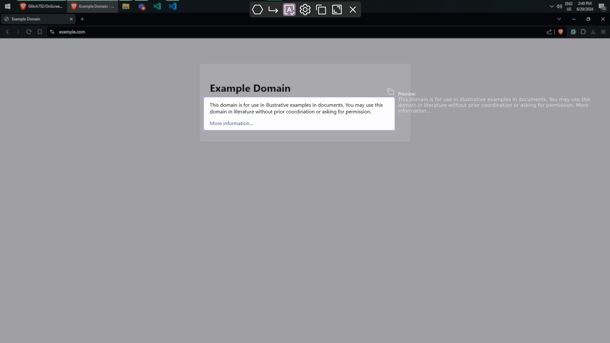
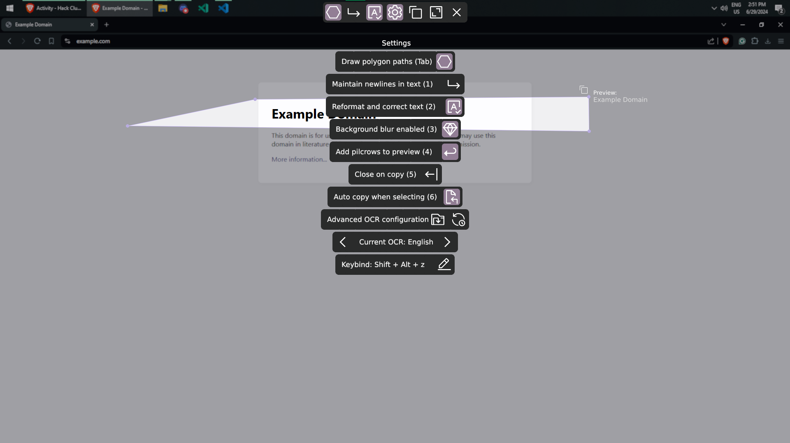
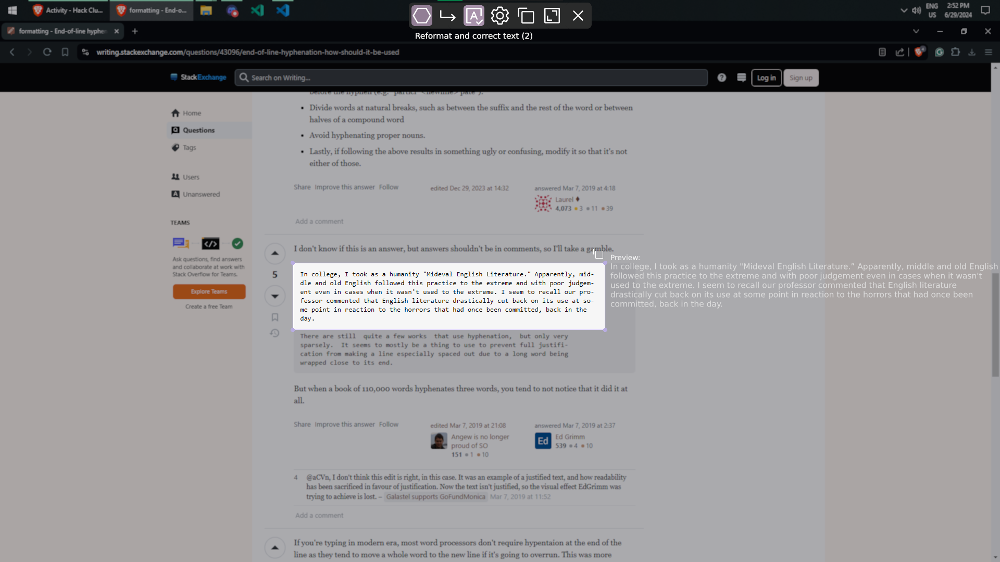

# OnScreenOCR
A powerful graphical on-screen optical character recognition (OCR) tool using Tesseract. I made this tool because I found places where I would like to improve existing tools like Microsoft PowerToys' "Text Extract" feature.


*Not my best logo design... I needed something for the system tray, though!*  

<ol>
  <li><a href="#features">Features</a></li>
  <li><a href="#pictures">Pictures</a></li>
  <li><a href="#installation">Installation</a></li>
  <li><a href="#configuration">Configuration</a></li>
  <li><a href="#todo">TODO</a></li>
  <li><a href="#development">Development</a></li>
  <li><a href="#creating-the-installer">Creating the installer</a></li>
</ol>

## Features

The features of OnScreenOCR include:
- Fully GPU-accelerated rendering using wgpu
- Multi-platform support: Windows, MacOS, and Linux (untested at the moment, some features TODO on other platforms)
- Live preview of the OCR result
- Support for taking screenshots
- Support for multiple OCR languages
- Result fixing and reformatting
  - Reformat to remove hyphens from end of lines, moving the word to fit entirely on the line
  - More to come in the future! If you have any suggestions or find common formatting failure points/annoyances, please open an issue!
- Ability to copy without newlines
- Ability to fine-tune Tesseract's parameters
  - Ability to export in other Tesseract formats (TSV, Alto, HOCR)
- Support for non-rectangular selections
- Support for multiple monitors
- Keybinds for common actions (Ctrl+C to copy, Ctrl+Z to undo, arrows to move selection, etc.)
- Full undo/redo history
- Stays in system tray when closed
- Numerous intuitive selection-related interactions, including drawing outlines, shifting edges/vertices, removing edges/vertices, and more.
- An installer that allows you to automatically start the application on boot

## Pictures




## Installation
You may download the application from the releases page.  
Currently, I only distribute x64 Windows binaries (since support for other platforms is untested and some features are not implemented on other platforms).  
I distribute an installer (`OnScreenOCR.exe`) and a standalone executable (`OnScreenOCRStandalone.exe`).  
The application will create an icon in your tray while running. The default keybind is `Shift + Alt + Z`, but you may change this within the overlay.

## Configuration
Configuration files are stored under your user's configuration directory.  
On Windows, this is `{FOLDERID_RoamingAppData}\OnScreenOCR` (usually `C:\Users\<username>\AppData\Roaming\OnScreenOCR`).
On MacOS, this is `~/Library/Application Support/OnScreenOCR`.  
On Linux, this is `$XDG_CONFIG_HOME/OnScreenOCR` or `$HOME/.config/OnScreenOCR`.  

Configuration files include:
- `settings.bin`: A binary file containing the application's simple settings, configurable from the application. (e.g. preserve newlines or background blur enabled)
- `tesseract_settings.toml`: A TOML file containing the Tesseract settings. When changing this file, the "reload" button must be clicked in the application. (e.g. OCR language, OCR parameters)
- `tessdata`: A directory containing the Tesseract data files. This directory is created when the application is run for the first time with a few default languages. To add more languages, simply copy the `.traineddata` files into this directory and add the language to the `tesseract_settings.toml` file. Configuration is documented in the file.
- `correction_data`: A directory containing the correcton data files. There is one subdirectory per required dictionary for correction. If no file exists for a language, the correction will not be applied.
  - Currently, there's only one type of correction -- the "hyphenated" correction. For every language you add that requires end-of-line hyphen correction, you should add a dictionary of hyphenated words to `correction_data/hyphenated/{language code}.txt`, with one word per line.

## TODO
- [ ] Add support for MacOS and Linux
- [ ] Better documentation on how the interaction system, configuration, and probably other parts of the application work

## Development
Since the OCR dependency used ([Leptess](https://github.com/houqp/leptess)) relies on vcpkg dependencies, you need to run the following (and clone with submodules!):
```bash
# To install the LLVM (clang)
winget install LLVM

# To install vcpkg dependencies
.\vcpkg\bootstrap-vcpkg.bat
.\vcpkg\vcpkg integrate install
.\vcpkg\vcpkg install tesseract:x64-windows-static-md
.\vcpkg\vcpkg install leptonica:x64-windows-static-md
```
NOTE: When installing, vcpkg can't be in a directory with spaces in the path!

On platforms other than Windows, follow the instructons in Leptess' README [here](https://github.com/houqp/leptess?tab=readme-ov-file#build-dependencies).

Finally, you can run the project:
```bash
cargo run
```

## Creating the installer

0. Install [Inno Setup 6](https://jrsoftware.org/isinfo.php)
1. Build the program with `cargo build --release` and move the executable from `target/release/OnScreenOCR.exe` into this folder. Make sure it is called `OnScreenOCR.exe`.
2. Open `OnScreenOCR.iss` in Inno Setup Compiler
3. Change `MyAppVersion` to the current app version.
4. Run Build -> Compile
5. The installer will be placed in a folder called `Output`

`installer/pre-install_message.txt` contains the message that is displayed before installation.
